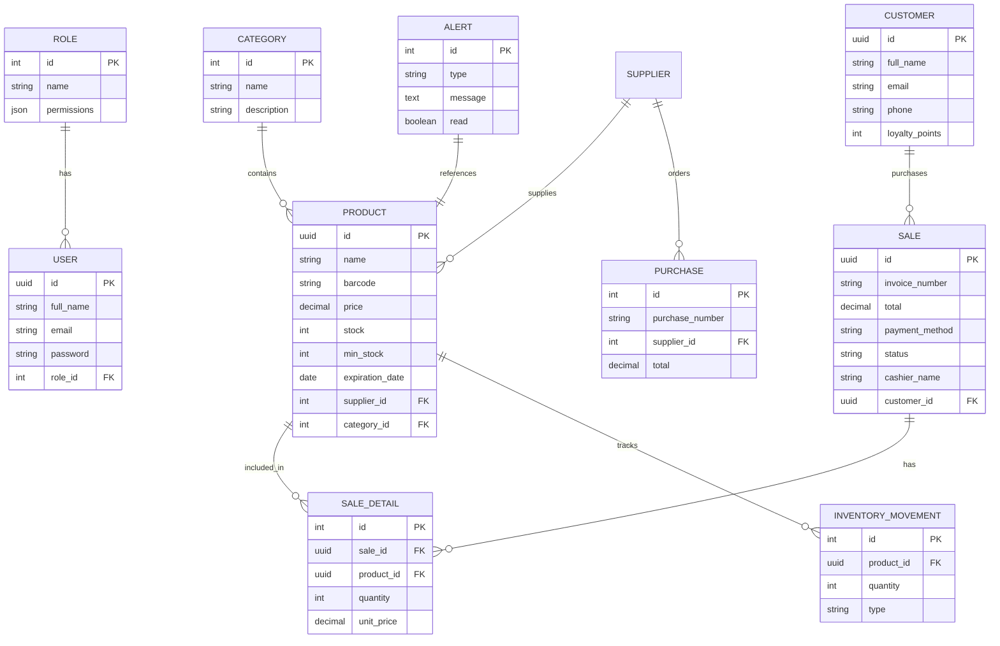

# Nova Salud Architecture

## System Overview

Nova Salud is built on a modular client-server architecture.

- Frontend: React + Vite + Tailwind, responsible for user interaction, dashboards, responsive workflows, and real-time notifications.
- Backend: Node.js + Express + PostgreSQL + Sequelize, responsible for secure API endpoints, business logic, inventory synchronization, sales processing, and alert generation.
- Realtime layer: Socket.io for live inventory and alert updates.

## High-level Components

- Authentication & Security
- User Management
- Inventory Management
- Sales Management
- Customer Management
- Supplier Management
- Reporting & Analytics
- Notification System

## ER Diagram

## Sequence Flow

1. User logs in through `/api/auth/login`
2. Frontend stores JWT and requests protected resources
3. Sales creation updates product stock and inventory movements
4. Critical stock or expiry triggers alerts
5. Dashboard requests summary stats from `/api/reports/dashboard`

## Deployment Notes

- Use Docker Compose locally for PostgreSQL, backend, and frontend.
- Production deployment should use managed PostgreSQL, HTTPS termination, CI/CD pipelines, and secret management for JWT keys.
